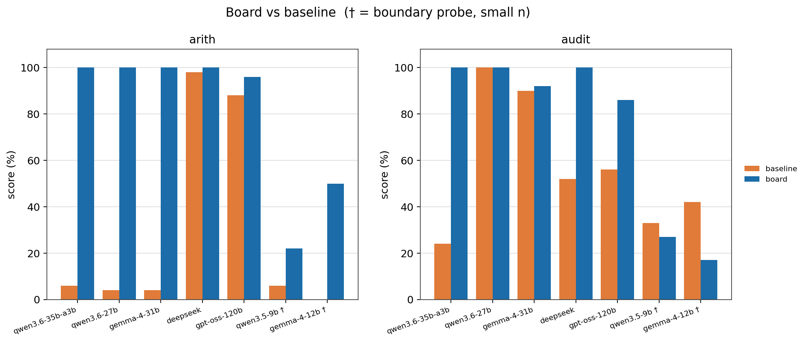

# 驱动地板：外部符号推理板何时能帮到大模型
### 从廉价量化的本地模型中恢复精确推理

**Victor Shaw**  ·  Independent Researcher  ·  michaltina@hotmail.com

> **试点研究 / 技术报告——发布草稿(中文版)。** 贡献是一套框架 + 一个开源系统 + 试点证据。跨模型与量化扫描已收敛;更完整的战役——工具增强 baseline、多 seed 统计、更广任务、部件消融——仍列为 future work(§7)。已收敛、可信的数据点横跨云端 `deepseek-v4-flash`、本地 `qwen3.6-27b`(4-bit/fp16/fp8)、`gemma-4-31b-qat`(官方 4-bit)、`gpt-oss-120b`(官方 4-bit),以及 **3B 激活** 的 `qwen3.6-35b-a3b` 锚点;fp16/fp8 量化梯度现已齐全(零结果,§6.5)。`gemma-4-12b` / `qwen3.5-9b` 作为边界探针上报(§5.5)。n=50/族,单机。本文为 `papers/preprint-draft.md` 的中文对应版。

## 摘要

大语言模型在**结构性**推理上仍不可靠——精确算术、让主张与证据一致、不报告从未派生过的结论——即便它们在开放式判断上越来越强。我们研究 **rulith**,一块"提议—裁决"的符号*推理板*:模型提议事实、规则、动作;板执行分层否定 Datalog 闭包、真值维护、精确(*exact-or-fail*)算术,并**门控**任何它没派生出的结论。

两个事实框定我们的结果。**其一,板的保证是*结构性的、与模型无关的*。** 它的算术精确,其认证来自派生而不是模型断言;这一点横跨云端与量化本地部署、四个结构性任务族、n=50/族。在信任探针上,**没有任何模型能让板把一个未修复的结果认证为已修复**(false-certify = 0%(coding-trust),*即便驱动塌掉的模型也是*);板**失败时关闭**,绝不**开放**。所以板的价值是一个可信属性,不只是分数。

**其二——也是我们的主发现——模型能否拿到这个可信属性,由一个可测量的能力决定,我们称之为*驱动地板*。** 它指模型*驱动*这个符号接口的能力。驱动地板**与自由推理可分离**,追踪模型的**训练代差(与总能力)**——不是比特宽度、不是每 token 的激活算力,也不是它是否"思考"。

具体地,试点支持一条简单的组织关系:**板增益 ≈ 自由推理出错率 × 驱动成功率**。一个推理差但驱动干净的模型能*恢复*精确推理——在便宜的本地模型上把硬难度算术从 4–10% 抬到 100%,最干净处只需 **3B 激活参数**。而驱动不了的模型什么也得不到;在要求*推导得来*结果的任务上,甚至可能比裸聊更差。因此我们报告一张诚实地图:板何处抬分、何处只是增加可信保证、何处反伤,以及如何选择与板匹配的模型。一个结构类推论是:**thinking 在板上冗余**——board + 思考 与 board + 非思考 同为 100,而**裸**思考模型多花 5–22× 的 token 仍够不到板的天花板。我们开源系统与可复现探针。本文为试点;完整战役为 future work,且我们**不**声称发明了"提议—校验"循环。

## 1. 引言

大模型的失败分两类。**能力(capacity)失败**——语义判断、想象力、世界知识——活在权重里,任何外部工具都修不了。**结构性(structural)失败**——多行求和里的一个错乘积、一句与桌面证据不一致的主张、一个从未验证过的"我修好了"——是机械的,恰好是一台保真演绎引擎能消除的那一类。本文关心第二类,以及一个系统:它消除这类失败,不是靠把模型变聪明,而是把推理里**机械那一半**搬到一块外部板上,精确执行、且骗不过。

在 agentic 系统里有一条近乎共识的经验:**harness 往往比模型更重要**——固定模型,harness 与脚手架的选择能把任务分数拉动几十分。这让一个问题因其缺席而显眼:**一个*符号* harness 究竟何时兑现、对谁兑现?** 强模型也许不太需要帮;而一个驱动不了 harness 的模型一点也得不到。本文就在一块具体的符号板上画这条边界。

板究竟给你买到什么?不是"平均更好的答案"——而是一个**可信保证**。板的算术精确,结论被门控:它不会报告一个它没派生出的结果,也不会背书一个从未做出的修复。关键是,这个保证**不依赖模型**。横跨我们测的每一种部署——云端、全精度、便宜的量化本地——*没有任何模型能让板把一个未修复的结果认证为已修复*(false-certify = 0%),而当一个弱模型的驱动塌掉时,板返回的是*什么也没有*,而不是某个假的东西:它**失败时关闭**,绝不**开放**。一个精确、带派生背书、且无论你把哪个便宜模型指向它都成立的结果——这就是奖品。

但有一个 catch,而它正是本文的主题。板只对模型**喂**给它的东西推理:要拿到这个保证,模型必须*驱动*这个符号接口——把一个问题变成事实与规则、吐出格式良好的操作、并在板拒绝某个操作时恢复。这个*驱动*能力**与自由推理可分离**:一个模型可以心算很差却驱动得无懈可击(于是继承板的精确算术),也可以推理很强却根本驱动不了。出人意料的是*什么*设定了它:在我们的试点里,驱动地板追踪的是一个模型的**训练代差**,而非它的比特宽度、也非它是否"思考"。一个驱动干净的便宜 4-bit 本地模型把 4% 正确的硬难度算术变成 100%;一个驱动不了的更高比特模型什么也得不到。我们把这总结成一个可预测的关系——**板增益 ≈ 自由推理出错率 × 驱动成功率**——并以全文刻画它。

我们用"提议 / 裁决"框架回答。模型**提议**:把问题建模成事实与规则,并跨轮驱动接口。板**裁决**:派生闭包、查一致性、精确算术、拒绝任何未派生的结论。模型供直觉,板供机械、演绎那一半。

**贡献。**
1. **驱动地板——主贡献。** LLM + 符号板系统的命门约束**不是模型的推理,而是它*驱动*接口的能力**:吐合法操作、把问题建模进板的词汇、被拒后能恢复。我们证明这个属性**与自由推理可分离**(模型可以推理差却驱动干净,反之亦然),且**追踪训练代差**,而非比特宽度或思考预算。我们给出一个组织关系——**板增益 ≈ 自由推理出错率 × 驱动成功率**——及其导出的 thinking × driving 2×2。
2. **结构性的、与模型无关的可信保证——赌注。** 因为板演绎地推理、并门控每个结论,它的结果精确、认证由派生背书,*与驱动模型的质量无关*:false-certify = 0% 跨全部模型,**包括驱动塌掉的**。驱动塌时**失败关闭**(空板、无结果),绝不**开放**(伪造结果)。这把**可信与模型能力解耦**——也正是驱动地板*值得在乎*的原因:你*驱动去拿*的,是一个可检查的保证。
3. **量化 / 算力结论。** 条件于驱动,板的输出**对量化、对 think/nothink 不变**——推理是板做的。而*驱动*侧:官方量化内,比特宽度与每 token 激活算力都**不**决定驱动——一个 **3B 激活** 的当代小模型驱动得和 dense 27B 一样干净;地板由**训练代差**设定,不是被多便宜地部署。
4. **一个开源系统、一张诚实地图、一条选型规则。** 我们开源 rulith 与可复现探针;报告板在何处抬分、何处只是增加可信保证、何处反伤(含负面结果);并给出选择与板匹配模型的实用规则:**偏好干净驱动的当代模型。** 指令遵循是可观察的选型代理;裸推理强度相对没那么重要,因为板供了机械推理。

## 2. 相关工作

我们用的这个回路——模型向一个符号校验器提议、校验器门控不安全或未派生的结论——**不是新的,我们也不声称是**。*约束校验 / 提议—校验执行:* G-SPEC [G-SPEC] 用知识图谱 + SHACL 门约束 LLM agent,其消融显示符号校验(其中图谱校验贡献 68%、SHACL 策略 24%)驱动了主要的安全增益;CEGIS 式的 LLM+SMT 规划循环 [CEGIS] 与面向流程控制的神经符号校验也是同一个"先提议后校验"的形状。*编译成确定性代码:* Compiled AI [CompiledAI]、PlanCompiler [PlanCompiler]、Blueprint-First [Blueprint] 把工作流逻辑与生成模型解耦、执行一个确定性产物。*接地 / 溯源:* claim–evidence 溯源与执行溯源工作 [PaperTrail, AgentTraces] 把结论系回到来源。

所以我们的新意**不在**提议—校验循环本身,而在:(i) **驱动地板**的实证刻画,(ii) **量化本地模型**上的板增益证据,(iii) **接地地板**(grounding floor,最弱前提分档 + "诚实是残余")。我们正面回应三条质疑:

- *"这不就是 G-SPEC 换皮?"* 循环不是我们的贡献;实证刻画(驱动地板 / 量化 / 何时帮)、一个统一的通用板、以及接地地板才是。
- *"板验不了头号失败——规格 / 前提对不对。"* **承认。** 接地地板把它显式化、人锚定、并标出最弱前提("诚实是残余")。我们**缓解而非消除**,并明说。
- *"凭啥上一整块 Datalog 板,而不是更好的提示或前沿模型?"* 因为精确算术与不可伪造门**与量化无关**,能从廉价量化模型里**不可伪造地**恢复精确推理——这是提示与前沿模型给不了的——而且我们量了。

## 3. rulith 推理板(系统)

rulith 是一个"提议—裁决"的符号推理板。模型提议事实、规则、动作;板做前向闭包、维护一致性、精确算术,并——关键地——**拒绝**任何未经派生的结论。分工很锐利:模型供直觉(建什么模、怎么驱动接口),板供机械、演绎那一半。板不让模型"会想";它让模型在可判定结构问题上的承诺变得精确、可审计、不可伪造。

设计服从一条三层纪律(`foundations.md`):保真演绎核(本节全部)、只许*提议*且产物必须回核重验的启发式层、以及明确**不准假装是推理**的工程基建(原子性、并发令牌、上下文窗口化)。下文只描述第一层——它是承载保证的那层。

### 3.1 工作记忆与分层闭包
板的状态是一块谓词工作记忆。规则(`add_axiom`)在其上前向触发,带分层否定(Datalog + 分层 NAF),物化分层闭包。所有改动经唯一入口,校验、规范化(数字串仅在可逆 round-trip 时规范化)、并门控派生——于是一致性契约只有一处强制点。

### 3.2 真值维护
每条派生事实带 `evidenceRefs`:一张 JTMS/ATMS 谱系的论证图。当支撑被撤回(被消耗或撤销的前提),依赖它的派生随之撤回。板区分两种移除,且这区分承重:**消耗**是*归档*——"曾真、已用尽";**撤销**是物理删除 + 证据级联——"从来不真"。每次 apply 记一条事件;事件只引用动作节点,可用性沿 `evidenceRefs` 递归,引用已归档事实的事件因而正确地隐身,而非悬空。

### 3.3 精确(exact-or-fail)算术
比较 / 算术 / 字符串内建是全函数,服从 *exact-or-fail* 契约:整数在 ±2⁵³ 内精确计算;越界、Infinity、NaN **令字面量失败**,而不是悄悄返回一个看似精确的舍入值。算术字面量按数据依赖自动定序,模型乱序写链式计算板也能推。这是板对大模型头号结构性失败——心算——的回答:与模型不同,板绝不产出一个被悄悄算错的"精确"数。

### 3.4 动作
动作是产生式规则的右部(OPS5 add/remove-WME 谱系):一个守卫式变换,消耗(负效果)并生产(正效果)工作记忆事实。它们是系统里非单调的那一半,但仍在产生式传统内;其效果在提交前先在克隆板上模拟,于是整条有序计划可在任何状态改变前被预演、被漂移守卫。

### 3.5 两道门(提议 / 裁决)
提议 / 裁决契约由两道门强制,它们是系统的硬核:

- **派生门(derivation gate)。** 一个守卫结论——例如编码任务里的 `finding(kind=fixed)`——必须从其证据**闭包派生**,不能凭空断言。板按出处给每条事实打标:`[derived]`(闭包推导)、`[effect]`(模型构造的动作产物)、`[asserted]`(模型裸断言)。只有 `[derived]` 能背书;另两种永远过不了守卫。
- **完成门(done gate)。** 非空板不许在没有一条已记录、*已派生*的结果时"完成"。一个自我盖章的目标——模型断言而非推导得来的——在终点线被拒。

这是本项目顶层命题在内核内部的递归应用:启发式提议,演绎裁决。模型不能靠陈述一个结论来给自己记功;它必须把原始观察放上板、加一条派生该结论的规则、让闭包产出它——否则门拒绝闭合。

### 3.6 接地地板(grounding floor)
板保证的是从前提到结论的*推理*保真且精确;它**不**保证前提本身为真。地面事实——一个体重、一笔诈骗金额、一个测得的指标——是系统与世界的接口,逻辑够不到自己外面去核验它们。证据因而按*可核验性*分三档,这条线横切所有领域(一个编程任务内部同时含三档),而非按领域分:

1. **derived(可重派生)**——闭包能重新派生它;不靠诚实,因为板直接 CHECK,撒谎当场被抓。
2. **attested(外部背书)**——它经一条不可伪造的通道进板:只有 harness/工具可写的机器背书谓词,或 `createdBy` 为 `tool`/`system` 的事实。信任落在*具名来源 + 通道*,而非模型泛泛的诚实。
3. **asserted(裸断言)**——模型自己放上板的。诚实只在这一档承重;这是板消不掉、只能暴露的残余。

`groundingOf` 沿一个结论的 `evidenceRefs` 走到地面前提,报最弱档 + 证人:一个结论的可信度不高于它最弱的那条地面事实。心智模型是*证据规则*,不是"诚实智能体"——法庭不信检方陈述的数字,它采信带保管链的记录,法官再保真地推到判决。**诚实是残余,不是地基:** 每条证据链都触底于某个观察,板让这层尽量小、有出处、显式标记,但消不掉。

### 3.7 函数依赖冲突
领域可声明一条函数依赖,`functional_dependency(predicate, key)`,断言某谓词内 key 参数决定其余(例如一个发票项有唯一的 cost)。内核只*裁决*:若两条事实共享声明的 key 但值不一致,它报冲突、把两条都标为 *disputed*、在常驻诊断里暴露,且 `derive_aggregate` **拒绝**一个有冲突的源,而非悄悄重复计数。声明一条依赖只会*收紧*(永远不能把结论洗白成真),所以——不同于背书——它无需可信通道门;模型声明自己的依赖也是安全的。这封住了我们在实践中观察到的一类*建模污染*:一个模型把本该让板派生的值裸断言(一个手算的 `cost`),现在会与派生值*相撞*而被标记,而非污染一个求和。

{width=95%}

## 4. 驱动地板

板的价值在不同模型间并不均匀。模型能否*提取*这价值,取决于一项我们命名为**驱动地板**的能力。它与自由推理能力可分离,且——我们最尖的试点发现——它由**模型的训练(代差 + 总能力)**决定,而非比特宽度、也非每 token 的激活算力。

### 4.1 驱动 ≠ 自由推理
我们分开两项能力:

- **自由推理(free reasoning)**——在权重里解题:做算术、看出坏账目行、知道一个修复是不是真的。
- **驱动(driving)**——吐合法的板操作、把问题*建模*成事实与规则、跨轮推进直到板背书出一个结果。

板替代自由推理的机械 / 演绎那一半。它**不**替代驱动:模型若喂不动板,板就拿不到数据,替代就不发生。驱动是一项协议技能,与模型不借助工具时推理多好大体正交。

### 4.2 增益关系
我们把试点总结成一个定性的组织关系:

> **板增益 ≈ (自由推理出错率) × (驱动成功率)。**

第一个因子说板只能救模型本会犯的错:在模型本就可靠的维度上,板贡献*结构保证*(一个不可伪造、有派生背书的结果)而非更高分。第二个因子说增益被驱动门控:出错率再高,板空着也买不到什么。两个因子都必要;乘积形式预测了板在哪帮、在哪只是保证、在哪根本帮不上。

### 4.3 thinking × driving 2×2
两个因子定义出一个 2×2,轴是*自由推理出错率*(低 / 高)与*驱动*(干净 / 塌)。甜点在**高出错 × 干净驱动**:一个自由推理弱(于是有很多可救)但驱动干净(于是救得到兑现)的模型。我们的锚点数据点正坐在这里:`qwen3.6-35b-a3b`——一个 **3B 激活** 的 MoE——把硬难度多行发票算术从**基线 6% 抬到 100%**(audit 24% → 100%),三族**零空板**(n=50);dense 4-bit 的 `qwen3.6-27b` 同款故事(4% → 100%)。模型几乎不贡献任何正确算术;板贡献全部,模型只管建模与驱动。没有比"一个完全算不动的模型,接上板变精确"更干净的"板替代推理"演示了。

其余象限作为*诚实*结果同样有教益。一个强 / 思考模型坐在低出错 × 干净驱动:板在分数上打平、添上结构保证(没多少错可救)——此时 thinking 已*冗余*:board + 非思考已追平 board + 思考,且只花零头的 token(§6.6)。一个驱动塌掉的模型坐在右列,无论出错率高低——板帮不上,而在要求它背书的任务上,塌掉的驱动甚至可能比裸聊*更差*。这些"何时不帮 / 何时反伤"的情形是贡献的一部分,不是脚注。

### 4.4 空板失败模式
典型的驱动失败是**空板(empty board)**:模型的操作没产出新事实——一个畸形 op、一个错谓词或错参数、一条没触发的规则——而模型不自知,然后盲目空转,常常转到轮次上限。它是弱驱动者的主导失败模式,直接追踪驱动成功率。在边界处,它通常是**格式锁死**:一次 malformed-JSON 小滑(多一个括号、少一个大括号、散文漏进调用)解析失败,而 transcript 只追加不重置,模型于是*重读自己的坏输出并重复它*——一个自回归陷阱;不处理时会烧到轮次上限(我们观察到过单题 70 分钟)。值得注意的是,底层推理常常还在:边界模型的 arith 失败*全是*空板,**零**个非空算术错(表 1)——模型能做题,只是过不了干净 op。

两个对策重要。**(i)** 每轮一行"Δ since your last op",在空 delta 时打出 **NOTHING CHANGED**、告诉驱动者上一步没产出任何东西——把一个静默失败变成可操作的教学信号,让模型去修 / 重试,而不是重复那个死调用。**(ii)** 诚实计数:空板*指标*只计**真正空的**板(零 derived facts),绝不把一个满但*错*的板也算成空板——错答案计作推理错误,不能误记成驱动塌。边界塌里到底有多少是模型、多少是脆弱 harness,这是一个测量选择;我们在 §4.5 与 §5.5 明说。

### 4.5 驱动地板是训练属性——不是比特宽度,也不是激活算力
担心在于:便宜——更少比特、或更少*激活*参数——会买来驱动塌。试点在**两条轴**上都否决。*比特宽度:* 官方量化内精度与驱动无关——`qwen3.6-27b` 在 4-bit / fp16 / fp8 都到 arith/audit 100、每次零空板(板的输出本就与精度无关)。*激活算力:* 最低算力的干净驱动者是 **3B 激活** 的 MoE(`qwen3.6-35b-a3b`:arith 100 / audit 100),而 **12B 激活** 的 dense(`gemma-4-12b`)与 **9B 激活** 的(`qwen3.5-9b`)塌进格式锁死——每 token 算力*更多*、驱动*更差*。同架构里第二个 MoE 把这点钉死:**4B 激活** 的 `gemma-4-26b-a4b`——比 3B 激活的锚点激活参数*更多*、但代际更老——只*部分*驱动(arith/audit 78 / 70),到不了 100。区别它们的是总能力与训练代差(当代 35B 总参 vs 更老的 9–12B),不是比特或每 token 算力。**地板是模型*训练*的属性,不是它被多便宜地部署。**

我们标一个**更正**,因为它关乎测量诚实。此前对本试点的一种读法——*粗糙量化*塌掉驱动——是 harness 假象:脆弱的 driver loop(无信息量的 parse 报错、不重置)把一次 malformed-JSON 小滑变成自回归锁死与空板(§4.4)。一旦 harness 定位 parse 错、界住循环,所谓量化/算力效应就消散,干净驱动的边界*回弹*到训练那条线上。那个曾被当成"粗糙 4-bit 塌"的同一模型(`qwen3.6-35b-a3b`:arith/audit 72/42)修后驱动到 100/100——它一直有能力,是 harness 在遮它。我们把地板报作训练属性,并披露 harness 策略(§5.5)。

这是廉价部署叙事最强的形态:精确、不可伪造的推理在 **3B 激活、4-bit、本地** 算力上即可恢复——一个当代小模型把板驱动得和 dense 27B 一样干净,而每 token 成本只是其零头。

驱动地板是板能*标记却不能跨越*的一族*地板*之一(`foundations.md`):**接地地板**(结论不强于其最弱前提)、**前沿地板**(自驱进展性被前沿模型的完备性所限,而后者是 asserted)、**驱动地板**(活性是外生的——板能*度量*停滞并升级,却不能把模型*验*成会驱动)。板的诚实不在于保证成功,而在于:每一步,能证的证了,判不到的标出来。标出它不能保证的,本身就是贡献。

{width=78%}

{width=68%}

## 5. 实验设置

### 5.1 模型
试点横跨云端全精度与本地量化部署,使量化成为一个变量而非混淆项。每跑都在 `data-manifest.md` 中标出 slug、量化、模式与端点,以防模型身份漂移。本地模型经 LM Studio 部署,云端经其 provider API。

**数据成熟度(诚实声明):** 收敛、可信的数据点是 **3B 激活** 的 `qwen3.6-35b-a3b`、`qwen3.6-27b`(4-bit/fp16/fp8)、`gemma-4-31b-qat`(官方 4-bit)、`gpt-oss-120b`(官方 4-bit)、部分驱动者 `gemma-4-26b-a4b`、以及云端 **deepseek-v4-flash** 各臂(非思考 `-chat` 与思考 `-reasoner`;最强的 *audit* 证据)。gemma/qwen 的 **fp16/fp8** 梯度现已齐全,收敛为**零结果**(§6.5)。`gemma-4-12b` 与 `qwen3.5-9b` 作为**边界探针**按严格 harness 上报(§5.5)。我们**剔除**一个云端跑:一个 pre-fix 的 `deepseek-flash-v4`,其 rule-laundering bug 抬高了 coding 误报率(已抓、已修、加回归;§7)。

### 5.2 任务族
四个探针,各隔离一类结构性失败;合起来张成**计算、数值推理、可信、修订**四能力轴。**arith**——硬难度的多行发票精确算术(8 位单价 × 5 位数量、多行),针对心算错误。**audit**——账目错误检测,按误报(凭空的 finding)与漏报(漏掉的错)计分。**coding-trust**——拦截虚假的"我修好了":一个被背书的修复必须有机器背书的证据,而非散文。

**revision —— 撤回下的信念修订。** 把一个访问控制世界表示为地面事实(用户的角色;哪些角色授予哪些权限;哪些权限启用哪些动作)+ 两条派生规则(角色 ∧ 授予 → 权限、权限 ∧ 启用 → 动作),闭包派生用户*可做*哪些动作。随后**撤回**一条事实(吊销一个角色或一条授予),任务是报告哪些派生结论仍然成立。判别性案例是**冗余支撑**结论——一个动作经两条独立权限路径启用、其中一条被撤——它必须**存活**;与之并列的是必须**撤回**的单支撑结论、以及**不受影响**的独立结论。这考的是板的真值维护层(撤回沿 `evidenceRefs` 级联,一个结论当且仅当**无任何**幸存派生时才被撤)——一种与计算(arith、audit)、可信(coding)两族都不同的**非数值**能力。我们扫描问题规模:每案 8–27 个被查结论、1–6 次撤回。

### 5.3 实验臂
每任务两臂。**baseline**——裸聊,按散文判(如 `ANSWER: N`)。**board**——模型驱动 rulith,*从板状态结构化计分*:每行 cost 与总额必须以 `[derived]` 事实出现(只有 asserted 的板计 FAIL),被标记的行必须 `[derived]`,被背书的修复必须带派生的 `finding(kind=fixed)`。board 臂不可能靠断言得分。

### 5.4 指标
每族的精确集解出率、误报防止率、**空板 / 驱动失败率**(没产出事实的操作)、token 计量(in/out/calls),配 Wilson 95% 置信区间;当区间不相交时标记 board 与 baseline 的差异。

### 5.5 设置的诚实性
n=50/族、单机、每格单跑——一项试点。评分器本身经审计并修正(§7):它对 baseline 否定的判断曾把一句诚实的"还没修好"误读成虚假声称,那会虚抬板的表观胜出;此问题已被抓、修、加回归。我们把*审计自己的测量*当作贡献的一部分。

**Harness policy。** 驱动是通过一个固定 driver loop 测量的,所以我们明说它的策略。干净 tier 的数字都是 **post-harness**——已经包含对格式错误报错、空板教学信号(§4.4)、以及空板*指标*更正(真正空板 vs 满但错误)的已提交修复。边界探针(`gemma-4-12b`、`qwen3.5-9b`)则在这个**严格** harness 下报告,并且刻意不加一层 per-model 的格式宽容或 loop reset;因此一次 malformed-JSON 小滑若把模型锁进空板,即便底层推理正确,仍计作驱动失败。它们的比例因此是一个**披露过的下界**;分桶证据(表 1:边界失败全是空板,零非空算术错)说明缺口是格式而非推理,更公平的 harness 会抬高它们。我们选择统一严格 harness + 明示披露,而不是给每个模型定制 harness、破坏跨模型可比性。

## 6. 结果

**表 1 —— 收敛试点矩阵(post-harness)。** 单元格 = board% / baseline%;`*` = Wilson 95% CI 不相交。空板 = 驱动地板信号(arith/audit),计数。false-cert = 板把未修复 bug 认证为已修复(结构性可信底)。干净 tier 行 n=50/族;**边界探针**为小 n(8–17),按严格 harness 报(§5.5)。完整结果矩阵见附录。*精度约定:* 未标注的本地行为 4-bit、非思考;`fp16`/`fp8` 与云端行标注精度与模式(`nt`/`think`);`gpt-oss-120b` 为 `lowthink`;云端=全精度。

| 模型 | arith b/base | audit b/base | coding cert | 空板(ar/au) | false-cert |
|---|---:|---:|---:|---:|---:|
| **qwen3.6-35b-a3b**(3B 激活 MoE) | **100**/6 * | **100**/24 * | 100/100 | 0 / 0 | 0% |
| qwen3.6-27b | 100/4 * | 100/100 | 100/100 | 0 / 0 | 0% |
| deepseek-v4-flash (nt) | 100/98 | 100/52 * | 100/100 | 0 / 0 | 0% |
| deepseek-v4-flash (think) | 100/86 | 100/26 * | 100/100 | 0 / 0 | 0% |
| gemma-4-31b | 100/4 * | 92/90 | 100/100 | 0 / 0 | 0% |
| gpt-oss-120b (lowthink) | 96/88 | 86/56 * | 100/100 | 0 / 0 | 0% |
| *边界探针(小 n, 严格 harness):* | | | | | |
| qwen3.5-9b(9B dense) | 22/6 | 27/33 | 100/100 | 14 / 5 | 0% |
| gemma-4-12b(12B dense) | 50/0 * | 17/42 | 100/100 | 6 / 2 | 0% |

读这张表。**(1) 锚点:** `qwen3.6-35b-a3b`(**3B 激活** MoE)驱动到 **arith 100 / audit 100**(基线 6 / 24)、0 空板——表中每 token 算力最低,也是我们找到的最低算力*干净*驱动者。**(2) 空板预测分数:** 0 空板 → 板抬升或打平;探针的空板是驱动塌——且是**格式锁死、非推理**(每个探针失败都是空板;*零*个非空算术错),更公平 harness 能救回;按严格 harness 报作**披露过的下界**(§5.5)。**(3) 驱动 ≠ 每 token 算力:** 3B 激活的 MoE 干净,而 **12B 激活** 的 `gemma-4-12b`、**9B 激活** 的 `qwen3.5-9b` 塌——激活*更多*、驱动*更差*;地板追踪总能力与训练代差(§4.5)。**(4) 可信底处处成立:** board false-cert **跨所有模型恒 0%**;裸 `gemma-4-12b` 把 **11/11 未修 bug** 全认证(100% 假阳)、板一个不认——裸模型最危险处,结构保证最锋利。

{width=98%}

### 6.1 各族行为
在 **arith**,弱 / 量化的非思考模型裸跑近零(硬难度下基线 4–10%),板把它们抬到区间顶端——板供了模型算不出的算术。在 **audit**,连强云模型不借助工具也会漏(一个思考 reasoner 裸跑低至 26%),而板达到 100% 且零凭空 finding——板赢最大的维度。在 **coding-trust** 两臂接近持平,因为我们跑的模型对修复状态诚实;这里板的价值是*结构保证*("修好了"必须有派生背书、不可伪造),不是分数。

### 6.2 增益追踪出错率
胜出集中在模型出错处(audit、弱 / 量化非思考模型上的 arith),并在模型本就可靠处归于打平(诚实模型上的 coding-trust;强算术上的 arith)。这是 §4.2 的增益关系从数据里读出来:**板赢的大小 ≈ 模型在该维度的出错率**;在可靠维度上,板贡献的是不可伪造的保证而非分数。

### 6.3 驱动地板(一个核心结果,不是局限)
决定性变量是模型能否驱动。边界探针把它显出来:`qwen3.5-9b` 在 arith 上产出 **14/18 空板**——board 22%、而*零*个非空算术错——一次驱动塌、非推理塌。空板失败(§4.4)是其机制。一个单独探针隔离原因:预喂地面事实(去掉建模 / 驱动负担、只留板的算术)把塌掉的运行翻成通过——喂动板才是问题,从不是板的算术。塌也对 harness 敏感(§4.5):边界塌的很大一部分是更公平 harness 能去掉的格式锁死,所以我们两件事都如实报——真正塌掉的 driver 没有增益(背书任务上甚至不如裸聊),而我们*确实*上报的边界失败是披露过的下界。我们把"板不帮 / 会反伤"留作一等结果,不藏在 limitations。

### 6.4 甜点——以及最低算力锚点
`qwen3.6-35b-a3b` 在我们测过的最低*每 token*算力上实现了高出错 × 干净驱动:一个 **3B 激活** 的 MoE,把 **arith 6% → 100%、audit 24% → 100%** 抬上去,三族零空板 / 零 DNF(n=50)。一个几乎不贡献正确算术的模型接上板就变精确——而且只用 **3B 激活参数,比塌掉的 dense 9–12B 还少**(§4.5)。`qwen3.6-27b`(4-bit)在 dense 档同款故事(arith 4% → 100%)。所以甜点不是单个幸运模型,而是一片*区域*:当代小模型、量化、本地,把板驱动干净并继承精确——价值落在部署最便宜处。

### 6.5 量化(已解决)
量化梯度现在齐了,是个**零结果:官方量化内,比特宽度不动驱动。** `qwen3.6-27b` 在 4-bit / fp16 / fp8 都到 arith/audit 100——同样的 board 分、每个精度零空板。`gemma-4-31b` 在 4-bit 与 fp16 同样干净(audit 92/98)。连锚点的两个 4-bit K-quant 混合(`qwen3.6-35b-a3b` Q4_K_S vs Q4_K_M)也只差一个 audit case(49 vs 50/50)——噪声、非精度效应。板的输出本就与量化无关(内核精确,不管几 bit),如今*驱动*侧也无比特敏感性。早先草稿报过一个"粗糙 4-bit 塌掉驱动"的对比;那是 harness 假象(§4.5),**撤回**。留下的地板是训练代差那条(§4.5):更老 / 更小的模型栽,当代的驱动得动,任何官方精度都如此。

### 6.6 成本——以及 thinking 的冗余
board 臂 input 很重(板视图每轮重发)、墙钟更慢;token 而非墙钟才是跨硬件可比单位(部署速度混淆墙钟)。但成本这一面有个**本身就是结果**的转折。**固定板、只切模型的 thinking:board 分数不动。** board + 非思考 = board + 思考 = **100**,在我们跑的每个干净 tier 变体上都成立(qwen3.6-27b、deepseek-v4-flash、gemma-4-31b;n=50)。thinking 在板之上加不出任何东西——因为板已经供了 thinking 链本来要磨出的那半"精确、机械"的推理。

再把 thinking 切到**裸**模型上:它抬高裸分,却**够不到板的天花板**——裸 + 思考在结构任务上仍只有 audit **26%**、硬算术 **86%**(deepseek-v4-flash,n=50;qwen3.6-27b 上低至 58%),对比板的 100;代价是**几倍的 token**:裸 + 思考的输出 token 是非思考版的 **5–22×**(deepseek arith 285K vs 51K;gemma-4-31b arith 440K vs 20K)。所以两个杠杆**不是替代品**:thinking 给裸模型买来更多 token 和一个更高但仍不够的分;板买来的是**天花板**、且只花非思考的成本。对板覆盖的结构类任务,**thinking 是冗余的**——你为板已经精确完成的推理又多付了几倍。(限定:thinking 仍帮**容量**类任务——开放式判断——那是板不碰的,§4.1。)

所以板的 token 换来的是:精确、不可伪造、以及——对本来 0/10 的模型——一个能用的答案,而且落在最便宜的非思考、低激活、量化本地档。

### 6.7 信念修订
**板可证明精确、且与规模无关;模型胜任,但随规模退化、且不可审计。** 我们在 `deepseek-v4-flash`(最干净的 driver)上跑修订族,横跨四档问题规模(n = 50/档)。

| 平均结论/案 | 撤回数 | **board** | baseline(每案) | baseline(每结论) | 模型过度撤回 |
|---:|---:|---:|---:|---:|---:|
| 8  | 1–2 | **50/50 (100%)** | 45/50 (90%) | 96.5% | 9 |
| 13 | 2–3 | **50/50 (100%)** | 43/50 (86%) | 94.7% | 24 |
| 19 | 3–4 | **50/50 (100%)** | 37/50 (74%) * | 93.9% | 39 |
| 27 | 4–6 | **50/50 (100%)** | 43/50 (86%) | 94.0% | 55 |

*(board 每档 0 错;`*` = Wilson 95% CI 不相交。同难度 19 结论的复测 baseline 为 80%、对上表 74%——表明 n=50 下每案口径有 ≈±6 pp 噪声;每结论列与错误计数是更稳的信号。)*

**board 每档 100%、0 错**:模型把它驱动得干干净净(4–6 轮、无空板——**驱动地板泛化**到本域),真值维护层精确撤回无支撑结论、保留每一个冗余/独立支撑结论。

模型的 **baseline(上下文内修订)不是"塌",是一个退化的近似。** 每结论从最小规模的 96.5% 降到大规模的 ~94%;等价地,每结论错误率约翻倍(3.5% → 6%),绝对过度撤回数增长约六倍(9 → 55)。全对/全错的每案率随之变噪(74–90%),但从未达到板的精确。失败是**单向过度撤回**:模型**收回了本该保留的访问**(dropped-live 比 kept-dead 约 26:1),因为它没注意到被吊销角色的动作仍由一个幸存角色启用。

这是一个**可信**结果,不是分数 lift。强模型把信念修订做得足够"像"可靠(~95%),但它 (i) 从不*可证明*正确,(ii) *不可审计*——没有派生可查,(iii) *随规模退化*——而这恰恰是板的精确、证据相连的修订*与规模无关*之处。在访问控制、合规、安全联锁这类错误修订有代价的场景里,一个 95% 且在下滑的黑箱还不够;一个可审计、可证明精确的修订系统是另一种可信对象。板在这里的价值是**结构性保证**(Contribution 2),并被"模型可靠性随问题增长而侵蚀"这一点放大。

{width=80%}

## 7. 局限与效度威胁
我们把主要威胁明说。**(a) 试点规模:** n=50/族、单机、窄合成任务、每格单跑。**(b) "0→" 里的量化混淆:** 一个量化模型的低*裸*分可能有一部分来自量化,而非纯不能;board 侧 100% 不受影响,而 fp16 非思考的基线(全精度、也低)在重跑后是更干净的对照。**(c) 驱动地板是模型 / 训练代差相对的**,不是绝对阈、也不是每 token 算力的函数(3B 激活的当代模型驱动干净、更大激活的旧模型却塌)。**(d) 评分器脆:** 我们自己对 baseline 否定的判断曾失手;已抓、已修、加回归——审计自己的测量是个效度加分项,不是藏起来的。**(e) coding-trust 在诚实模型上打平**;那里的价值是结构保证,不是分数。

**(f) 数据成熟度:** fp16/fp8 梯度现已齐全,收敛为**零结果**(§5.1、§6.5);边界探针 `gemma-4-12b` / `qwen3.5-9b` 是小 n、按严格 harness 上报的**披露下界**(§5.5)。**(g) "气密"限定于证据出处裁决,不是最低 trust floor:** 板从不放过伪造/误标的结论,但自驱 done(`receipt.closed`)报接地档而非据其阻断,于是自驱完成路径绕过了手动 `done` 跑的两层(可信 `required_floor` 门 + asserted-finding 审计)——一处已知、bench-pending 的不对称(不腐蚀任何完成*主张*)。**(h) 函数依赖冲突默认 opt-in:** arith bench 有意撤掉 `functional_dependency` seed(它伤弱模型 driving),所以 p10 那类裸断言污染**默认可达**,除非显式声明依赖。完整战役还要补:更多 n × 种子带统计、更多模型与量化档、更广更标准的任务、更强的 baseline(CoT / 工具调用 / code-interpreter,而非只裸聊)、以及隔离各板部件(派生门 / 接地地板 / 函数依赖冲突)各自贡献的消融。

## 8. 结论
板替代推理里机械、演绎那一半——精确算术、一致性、拒绝未派生——同时把判断留在权重里。命门约束不是模型的推理而是它的**驱动**:能否喂动符号接口,一项与推理可分离、且在我们的试点里追踪训练代差(而非比特宽度或部署形态)的能力。实际推论是:一个好的廉价 4-bit 本地模型 + 板,可以在最便宜的部署档位恢复精确、不可伪造的推理。一句心智模型:**模型提议(建模 + 驱动);板推理(派生、查一致、精确算、拒未证)。** 我们开源系统与可复现探针:<https://github.com/rulith-dev/rulith>。

## 附录:完整结果矩阵

**表 A1 —— 完整结果矩阵。** 单元格 = `board% / baseline%`;`*` = Wilson 95% CI 不相交(board vs baseline)。n=50/族,除 `qwen3.6-27b(fp16, think)`(n=36)与小 n 边界探针。**正文表 1 是头条子集;** 本表补全完整的 精度 × 思考 梯度与部分/边界驱动者。精度约定同表 1(未标注=4-bit 非思考;云端=全精度)。三个被剔除的跑见 §5.1。

| 模型 | arith b/base | audit b/base | coding cert | 空板(ar/au) | false-cert |
|---|---:|---:|---:|---:|---:|
| deepseek-v4-flash (nt) | 100/98 | 100/52 * | 100/100 | 0 / 0 | 0% |
| deepseek-v4-flash (think) | 100/86 | 100/26 * | 100/100 | 0 / 0 | 0% |
| **qwen3.6-35b-a3b**(3B 激活 MoE) | 100/6 * | 100/24 * | 100/100 | 0 / 0 | 0% |
| qwen3.6-27b | 100/4 * | 100/100 | 100/100 | 0 / 0 | 0% |
| qwen3.6-27b (fp16, nt) | 100/6 * | 100/100 | 100/100 | 0 / 0 | 0% |
| qwen3.6-27b (fp16, think) | 100/58 * | 100/97 | 100/100 | 0 / 0 | 0% |
| qwen3.6-27b (fp8, nt) | 100/10 * | 100/98 | 100/100 | 0 / 0 | 0% |
| qwen3.6-27b (fp8, think) | 100/96 | 100/100 | 100/100 | 0 / 0 | 0% |
| gemma-4-31b | 100/4 * | 92/90 | 100/100 | 0 / 0 | 0% |
| gemma-4-31b (fp16, nt) | 100/4 * | 98/94 | 100/100 | 0 / 0 | 0% |
| gemma-4-31b (fp16, think) | 100/96 | 100/100 | 100/100 | 0 / 0 | 0% |
| gpt-oss-120b (lowthink) | 96/88 | 86/56 * | 100/100 | 0 / 0 | 0% |
| *部分 / 边界驱动者:* | | | | | |
| gemma-4-26b-a4b(4B 激活 MoE) | 78/32 * | 70/84 | 96/100 | 3 / 0 | 0% |
| gemma-4-12b(12B dense) | 50/0 * | 17/42 | 100/100 | 6 / 2 | 0% |
| qwen3.5-9b(9B dense) | 22/6 | 27/33 | 100/100 | 14 / 5 | 0% |

读这张表:每个干净 tier 的模型——云端、4-bit、fp16、fp8、思考与否——都驱动到 **arith/audit board 100**,精度 × 思考 梯度是平的(§6.5–6.6)。部分/边界驱动者是驱动退化处:board 打平或下滑、空板出现。它们追踪**训练代差,非激活参数**——4B 激活的 `gemma-4-26b-a4b` 比 3B 激活的锚点驱动*更差*(78 / 70)(§4.5)。board false-cert **每行恒 0%**。

## 致谢

本文的撰写、图表与数据整理借助了 AI 助手(Claude);系统实现(rulith)、实验设计、运行与结果均为作者本人完成,文责自负。

## 参考文献
*(所有 arXiv 编号、标题与作者已核实存在。)*
- **[G-SPEC]** Divya Vijay, Vignesh Ethiraj. Graph-Symbolic Policy Enforcement and Control (G-SPEC): A Neuro-Symbolic Framework for Safe Agentic AI in 5G Autonomous Networks. arXiv:2512.20275.
- **[CompiledAI]** Geert Trooskens et al. Compiled AI: Deterministic Code Generation for LLM-Based Workflow Automation. arXiv:2604.05150.
- **[PlanCompiler]** Pranav Harikumar. PlanCompiler: A Deterministic Compilation Architecture for Structured Multi-Step LLM Pipelines. arXiv:2604.13092.
- **[Blueprint]** Libin Qiu et al. Blueprint First, Model Second: A Framework for Deterministic LLM Workflow. arXiv:2508.02721.
- **[CEGIS]** Sumit Kumar Jha et al. Neuro-Symbolic Reasoning for Planning: Counterexample-Guided Inductive Synthesis using Large Language Models and Satisfiability Solving. arXiv:2309.16436.
- **[PaperTrail]** Anna Martin-Boyle, Cara A. C. Leckey, Martha C. Brown, Harmanpreet Kaur. PaperTrail: A Claim-Evidence Interface for Grounding Provenance in LLM-based Scholarly Q&A. arXiv:2602.21045(CHI'26).
- **[AgentTraces]** Yiqi Wang et al. From Agent Traces to Trust: A Survey of Evidence Tracing and Execution Provenance in LLM Agents. arXiv:2606.04990.

## 附录 — 可复现性
开源系统 + 探针:<https://github.com/rulith-dev/rulith>(npm:`rulith`);bench 矩阵与各臂计分契约见 `docs/benchmarks.md`,run 到模型的映射见 `docs/papers/data-manifest.md`。甜点那一跑可复现(PowerShell,经 LM Studio 的本地 27B 非思考):
```powershell
$env:RULITH_LLM_MODEL="qwen/qwen3.6-27b"; $env:RULITH_LLM_BASE_URL="http://127.0.0.1:1234/v1"
$env:RULITH_LLM_TIMEOUT_MS="600000"; $env:RULITH_MAX_TOKENS="32000"; $env:RULITH_BENCH_N="50"
$env:RULITH_BENCH_UNIT_DIGITS="8"; $env:RULITH_BENCH_QTY_DIGITS="5"
npm run verify:bench-arith
npm run verify:bench-audit
npm run verify:bench-coding-trust
```
聚合矩阵(Wilson CI、board vs baseline、token 计量)由 `npx tsx src/examples/bench-aggregate.ts` 在各臂运行日志上聚合生成。
